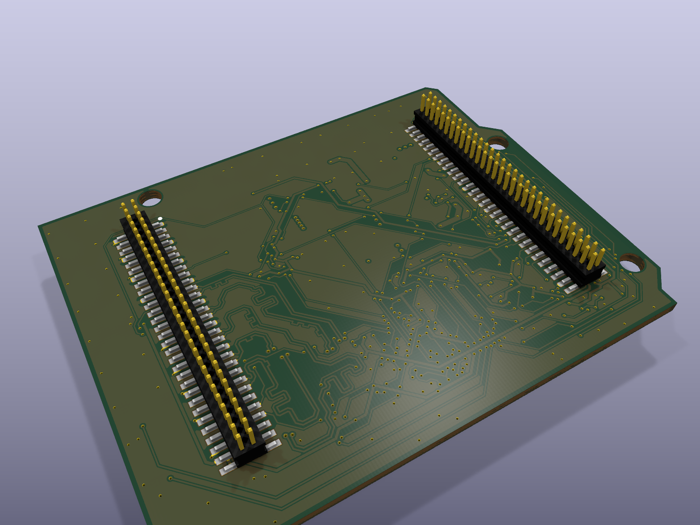

# Walking robot kit: electronics and control software

Open hardware and software for a small two-legged walking robot built on the
Arduino UNO Q. Fifteen Feetech bus servos on one TTL chain, a four-layer hat
that carries the camera, the audio, the distance sensor, the inertial sensor
and the servo bus, and a daemon on the board that owns the chain and serves a
live control page at 50 Hz.

Everything here is ours and is yours to use. The printed shell is not in this
release yet; see [What is not here](#what-is-not-here).

## What is in the box

| folder | what |
|---|---|
| `electronics/hat/` | the UNO Q hat: KiCad project, schematic, gerbers, BOM and pick-and-place, plus the Python that generates all of it |
| `electronics/imu-board/` | a small breakout for the body inertial sensor |
| `firmware/bus-bridge/` | the Arduino sketch that runs the servo chain on the MCU |
| `software/servo-bus/` | the Rust daemon that owns the bus and serves the control page |
| `software/tools/` | small Python tools: check supply voltage, record joint limits, hold a pose |
| `docs/` | wiring, servo IDs, and how to bring the robot up the first time |

## What you need

- An Arduino UNO Q (ABX00162). The Linux side runs the daemon, the MCU side runs the bus.
- Fifteen Feetech STS-protocol bus servos at 1 Mbit/s. We use the HD-1910-C001.
- The hat from `electronics/hat/`, or a URT-2 adapter on D0/D1 if you only want to
  drive servos and skip the camera and audio.
- A battery between 5.0 V and 8.4 V with enough current for fifteen servos.
  Never a two-cell pack in series: 13 V burns every servo on the chain in seconds.
- A computer with Rust and either the board on your network or a USB cable.

## Build it

The hat is a four-layer board, 68.68 by 53.44 mm, ENIG. Send
`electronics/hat/fab/gerbers.zip` to any PCB maker, with `fab/bom.csv` and
`fab/cpl.csv` if you want it assembled. `electronics/hat/schematic.pdf` is the
circuit on paper. The KiCad 10 project is in `electronics/hat/kicad/` if you want
to change it, and `board.py`, `sch.py` and `hat_parts.py` are what generated it.

## Program it

Build the daemon for the board, on your computer:

    rustup target add aarch64-unknown-linux-gnu
    cargo install cargo-zigbuild                      # and install Zig
    cd software/servo-bus
    cargo zigbuild --release --target aarch64-unknown-linux-gnu

Then push the binary, the sketch and the service to the board:

    cd software
    BOARD=arduino@<board address> ./install.sh        # over the network
    ./install.sh --adb                                # or over USB

The sketch compiles and flashes on the board, which takes about a minute the
first time. Nothing moves: the daemon starts with torque untouched and only
reads the bus.

Try it without hardware first:

    cd software/servo-bus && cargo run --release -- --fake --port 8938

Then open <http://127.0.0.1:8938/>. The fake bus puts two servos on ID 1 so you
can see the duplicate-ID warning.

## Run it

Open `http://<board address>:8938/` on a phone or a computer. Every servo on the
chain shows up within two seconds: angle, load, current, temperature, supply
voltage, torque state and the angle limits it is clamped to. Add `?control` to
the URL for a position slider per servo.

Plug servos in one at a time to set their IDs. They all leave the factory at
ID 1. `docs/servos.md` has the ID map and what the page refuses to do.

`docs/running.md` is the first bring-up, in order: charge, power on, hold the
zero pose, check the inertial sensor, move one joint.

## What is not here

The printed shell. Our current parts were dimensioned from a third party's
simulation meshes, which are licensed for non-commercial use only, so we cannot
put them under an open licence. They are being redrawn from our own
measurements and will land here when that is done.

## Licence

The software, the firmware and the generator scripts are Apache-2.0
([LICENSE](LICENSE)). The board designs, the gerbers and the BOMs are
CC BY-SA 4.0 ([LICENSES/CC-BY-SA-4.0.txt](LICENSES/CC-BY-SA-4.0.txt)), because
the camera routing on the hat is copied from Arduino's own UNO Media Carrier,
which is share-alike.

Third-party work this builds on is credited in [NOTICE](NOTICE).
